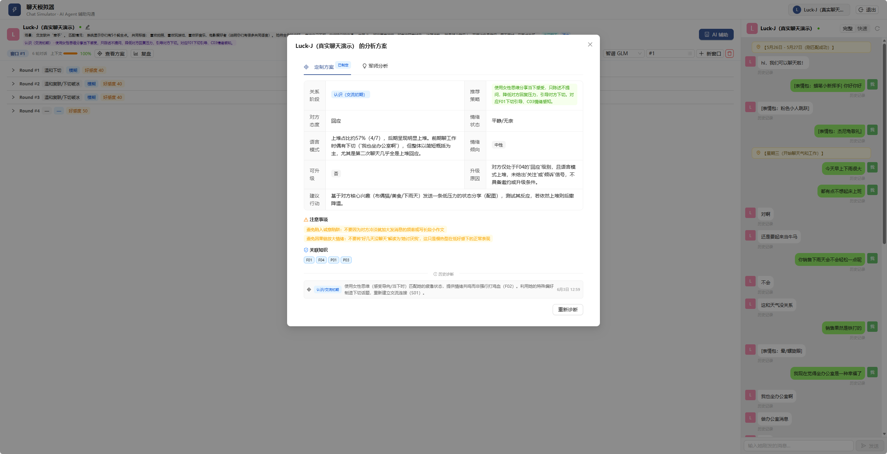
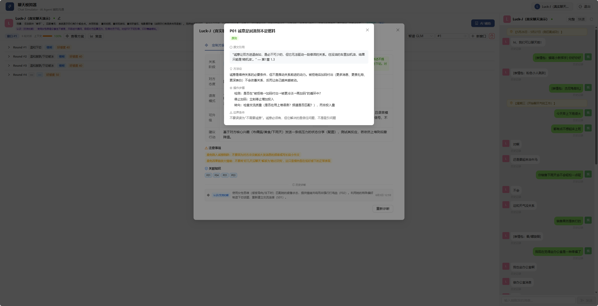
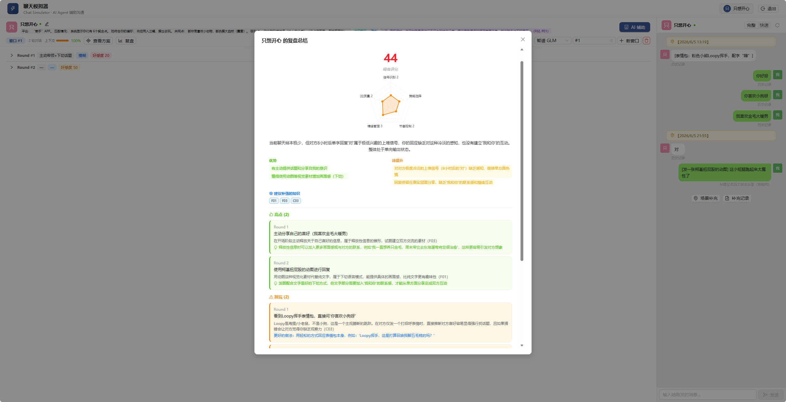

<div align="center">

# 💬 Chat Reply

### 你的 AI 聊天军师

**聊天时大脑一片空白？AI 帮你想。**

不知道怎么回消息、搭讪不敢开口、聊着聊着就冷场——<br>
把《魔鬼约会学》的方法论塞进 AI，让它在你最需要的时刻帮你一把。

[](https://react.dev)
[](https://expressjs.com)
[](https://www.typescriptlang.org)
[](LICENSE)

<p align="center">
  
  
</p>
<p align="center">
  
</p>

</div>

---

## 目录

- [😅 为什么做了这个](#-为什么做了这个)
- [🧠 知识引擎：它的灵魂](#-知识引擎它的灵魂)
- [✨ 功能一览](#-功能一览)
- [🚀 5 分钟跑起来](#-5-分钟跑起来)
- [🛠 技术栈](#-技术栈)
- [📁 项目结构](#-项目结构)
- [📡 API 文档](#-api-文档)
- [🧪 测试数据](#-测试数据)
- [📦 部署](#-部署)
- [🤝 参与贡献](#-参与贡献)
- [🙏 致谢](#-致谢)

---

## 😅 为什么做了这个

你可能也有过这些时刻：

> 对方发了条消息，你盯着屏幕想了 10 分钟，打了又删，删了又打，最后回了个"哈哈"。
>
> 鼓起勇气跟喜欢的人说句话，对方回了三个字，你瞬间不知道怎么接了。
>
> 明明聊得还行，突然就冷了，完全搞不懂哪里出了问题。

我就是这种人。不敢搭讪，不会聊天，见到喜欢的人大脑直接宕机。

后来看了阮琦老师的《魔鬼约会学》，才发现聊天不是天赋，是有方法的。但看书和实战之间隔着一条鸿沟——**你知道了理论，面对那条消息的时候，大脑还是一片空白。**

所以我做了 Chat Reply：**把方法论变成一个随时在线的军师，在你聊天的每一刻，实时帮你分析、建议、甚至直接帮你想好怎么回。**

---

## 🧠 知识引擎：它的灵魂

Chat Reply 不是随便调个 AI 让它帮你回消息。它的核心是一套**结构化的知识引擎**。

基于阮琦老师（网名"魔鬼咨询师"，北大心理学出身，潜心研究男女交往十余年）在[《魔鬼约会学》](https://book.douban.com/subject/25839107/)中提出的方法论，我们把整本书的精华拆成了 **23 个知识单元**。AI 在你每次聊天时，会实时匹配相关知识并注入分析。

**它能教会你什么：**

**读懂对方的真实态度** — 她说"嗯嗯"和"然后呢"完全是两码事。上堆是敷衍，下切是兴趣。不用猜，看说话方式就知道。

**知道什么时候该说什么** — 初期接触要降低压力，聊天升温要制造趣味，暧昧期才能试着升级。搞错阶段，再好的话术也白搭。

**避开你自己意识不到的坑** — 明明对她很好却不领情？那可能是"诚意陷阱"，感动 ≠ 心动。把她想得太完美觉得非她不可？那是"真命天女症"。系统会在聊天过程中自动检测并提醒你。

<details>
<summary>📋 23 个知识单元完整一览</summary>

| 类别 | 编号 | 知识点 | 一句话说清 |
|------|------|--------|-----------|
| 🔍 **框架** | F01 | 上堆下切模型 | 区分敷衍和兴趣的利器 |
| | F02 | 四大法则 | 判断关系状态的罗盘 |
| | F03 | 态度判断框架 | 回应→倾诉→关注→依顺，你在哪一级 |
| | F04 | 关系阶段模型 | 不同阶段用不同策略，别搞混了 |
| | F05 | 信号三分类 | 一条消息是正面、负面还是模糊，决定了你怎么回 |
| | F06 | 好感度评估 | 追踪关系变化，不做盲目的人 |
| 🎯 **原则** | P01 | 诚意法则 | 真诚 ≠ 无脑付出 |
| | P02 | 关注反应法则 | 别看她说什么，看她愿不愿意继续聊 |
| | P03 | 被拒绝的应对 | 被拒不可怕，死缠才可怕 |
| | P04 | 开场原则 | 自然大于巧妙，低压力大于高冲击 |
| | P05 | 扩大冲突法则 | 有趣的小摩擦比无聊的和谐更吸引人 |
| | P06 | 安全回复兜底 | 不确定说什么时，表达自己而不是评价对方 |
| | P07 | 升级判断 | 正面回应 ×2 才能升级，缺一个都不行 |
| | P08 | 模糊信号处理 | 不确定时按中性处理，别脑补 |
| 🎪 **场景** | S01 | 搭讪开场 | 3 秒法则 + 低压力开场白 |
| | S02 | 微信聊天 | 文字节奏、话题选择、何时邀约 |
| | S03 | 邀约时机 | 降低门槛法、模糊→具体邀约 |
| | S04 | 暧昧升级 | 好感信号判断、升级节奏 |
| | S05 | 被拒绝后 | 情绪管理、关系修复、何时放手 |
| ⚠️ **概念** | C01 | 真命天女症 | 把她想得太完美，反而失去自我 |
| | C02 | 诚意陷阱 | "对她好"≠ 吸引她 |
| | C03 | 大姧升级 | 还没到那一步就表白，功亏一篑 |
| | C04 | 因果链放大 | 她没回消息 → 她不喜欢我 → 我是废物（打住！） |

</details>

这些知识不是死的。AI 会根据聊天内容、阶段、信号类型，**动态匹配最相关的知识单元**注入分析。不同模式激活不同的知识组合：完整模式用全量知识做深度分析，快速模式精简为查表格式秒回，军师模式聚焦诊断，复盘模式聚焦纠错。

---

## ✨ 功能一览

<table>
<tr>
<td width="50%">

### 🤖 AI 实时回复
输入对方的消息，AI 会：
- 分析信号类型（正面 / 负面 / 模糊）
- 判断关系阶段和好感度
- 结合知识库推荐策略
- 生成 4 种不同风格的回复

</td>
<td width="50%">

### 🎯 军师诊断
不生成回复，只做分析：
- 对方的态度等级和语言模式
- 情绪类型和正负向
- 是否到了升级时机
- 下一步具体行动方案
- 自动检测心理陷阱

</td>
</tr>
<tr>
<td>

### 📈 复盘学习
聊完之后回头看看：
- 五维雷达图评分
- 哪些回合处理得好 / 犯了错
- 你最需要补强什么知识

</td>
<td>

### 💾 实用工具
- 📋 粘贴微信聊天记录自动解析导入
- 📊 好感度变化趋势图
- 🔄 回复版本管理（多次生成可对比）
- 📱 移动端适配
- 🎓 新手引导教程

</td>
</tr>
</table>

---

## 🚀 5 分钟跑起来

### 环境要求

- Node.js >= 18
- npm >= 9
- 一个[智谱 API Key](https://open.bigmodel.cn)（免费额度即可）

### 安装

```bash
git clone https://github.com/Academicrubbish/chat-reply.git
cd chat-reply

# 后端
cd chat-reply-server
cp .env.example .env
npm install && npm run dev

# 前端（新终端）
cd chat-reply-trainer
npm install && npm run dev
```

### 配置

编辑 `chat-reply-server/.env`，填入 API Key：

```env
# 智谱 GLM（推荐，有免费额度）
ZHIPU_API_KEY=你的API密钥
ZHIPU_BASE_URL=https://open.bigmodel.cn/api/paas/v4/
ZHIPU_MODEL=glm-5.1
```

> 获取 API Key：[open.bigmodel.cn](https://open.bigmodel.cn) · 仅支持智谱 GLM（OpenAI 兼容协议）

### 试试效果

```bash
# 导入 8 个测试场景（后端运行中执行）
node test-data/seed.js
```

打开 http://localhost:5173 → 注册 → 选择聊天对象 → 输入消息 → 点「AI 辅助」

---

## 🛠 技术栈

| 层级 | 技术 | 亮点 |
|------|------|------|
| 前端 | React 19 + Vite 8 + Ant Design 6 + Tailwind CSS 4 | SSE 流式渲染 + 响应式 |
| 后端 | Express 5 + TypeScript + SQLite (sql.js) | 零配置数据库 |
| AI | 智谱 GLM | OpenAI 兼容协议 |
| 知识引擎 | RIA++ 方法论 · 23 知识单元 | 静态/动态 Prompt 拆分 + 动态匹配注入 |

---

## 📁 项目结构

```
chat-reply/
├── chat-reply-server/
│   └── src/
│       ├── knowledge/          🧠 知识库（核心）
│       │   ├── frameworks.ts   # F01-F06 诊断框架
│       │   ├── principles.ts   # P01-P08 核心原则
│       │   ├── scenarios.ts    # S01-S05 场景策略
│       │   ├── concepts.ts     # C01-C04 心理概念
│       │   └── mode-mapping.ts # 模式→知识映射
│       ├── prompt.ts           # 提示词工程（静态/动态拆分）
│       ├── llm.ts              # 多模型 LLM 调用
│       └── index.ts            # API 路由
│
├── chat-reply-trainer/
│   └── src/
│       ├── components/         # 20+ React 组件
│       ├── hooks/useAppState.tsx
│       └── services/api.ts     # REST + SSE
│
└── test-data/                  # 8 个测试场景
```

---

## 📡 API 文档

### 核心接口（SSE 流式）

| 方法 | 路径 | 说明 |
|------|------|------|
| POST | `/api/sessions/:id/generate` | AI 生成回复 |
| POST | `/api/sessions/:id/regenerate` | 换一批回复 |
| POST | `/api/sessions/:id/analyze` | 军师诊断 / 复盘 |
| POST | `/api/sessions/:id/select-reply` | 选择一条回复 |
| POST | `/api/sessions/:id/custom-reply` | 自定义回复 |

### SSE 事件流

```
step → analyze / generating / parsing → delta → analysis → plan → replies → done
```

<details>
<summary>📋 完整 API 列表</summary>

**认证**
`GET /api/auth/status` · `POST /api/auth/setup` · `POST /api/auth/register` · `POST /api/auth/login`

**聊天对象 & 消息**
`GET/POST /api/targets` · `GET/PUT/DELETE /api/targets/:id` · `GET/POST /api/targets/:id/messages` · `PUT/DELETE /api/messages/:id`

**分析**
`GET /api/targets/:id/analyses` · `GET /api/targets/:id/diagnoses` · `GET /api/targets/:id/warnings`

</details>

---

## 🧪 测试数据

8 个覆盖不同阶段和信号类型的场景，导入即可体验：

| 场景 | 阶段 | 信号 | 你会学到 |
|------|------|------|---------|
| 初次破冰 | 初期接触 | 正面 | 怎么识别开场信号 |
| 上堆冷淡 | 初期接触 | 负面 | 什么是"上堆"敷衍 |
| 聊天升温 | 聊天升温 | 正面冲突 | 怎么制造有趣的互动 |
| 暧昧升级 | 暧昧期 | 正面冲突 | 怎么判断升级时机 |
| 模糊信号 | 聊天升温 | 模糊 | 不确定时怎么处理 |
| 被拒绝 | 聊天升温 | 负面 | 被拒后怎么办 |
| 诚意陷阱 | 混合 | 负面 | 识别"感动≠心动" |
| 快速邀约 | 聊天升温 | 正面 | 什么时候可以约出来 |

```bash
node test-data/seed.js [--user tester --pass test1234]
```

---

## 📦 部署

```bash
# 构建
cd chat-reply-server && npm run build
cd chat-reply-trainer && npm run build

# 后端
npm install --omit=dev && node dist/index.js

# 前端（Nginx）
# location / { root /app/frontend-dist; try_files $uri /index.html; }
# location /api { proxy_pass http://127.0.0.1:3001; }
```

---

## 🤝 参与贡献

欢迎各种形式的贡献！

1. Fork 本仓库
2. 创建特性分支 (`git checkout -b feature/AmazingFeature`)
3. 提交更改 (`git commit -m 'Add some AmazingFeature'`)
4. 推送到分支 (`git push origin feature/AmazingFeature`)
5. 提交 Pull Request

**可以贡献的方向：**
- 🧠 新增知识单元（社交场景、心理概念等）
- 🌐 国际化支持（英文 UI / 双语 README）
- 🤖 接入更多 LLM 模型
- 📱 改进移动端体验
- 🐛 修复 Bug / 完善文档

---

## 🙏 致谢

- **阮琦**（魔鬼咨询师）— [《魔鬼约会学》](https://book.douban.com/subject/25839107/)及魔鬼三部曲，这套方法论改变了很多人对社交的认知
- 本项目知识库基于阮琦老师的方法论构建，用 AI 技术让这些知识在你最需要的时刻帮你一把

## 📄 许可证

[MIT License](LICENSE)

---

<div align="center">

*Chat Reply — 别再盯着聊天框发呆了*

**[⬆ 回到顶部](#-chat-reply)**

</div>
