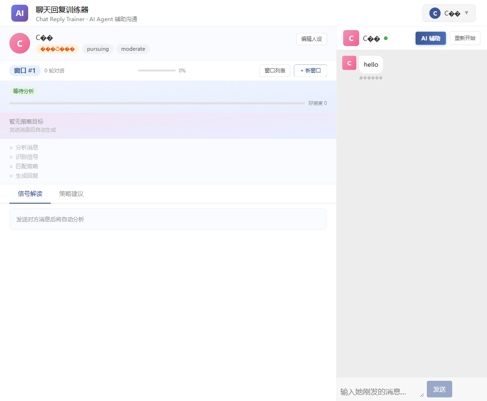
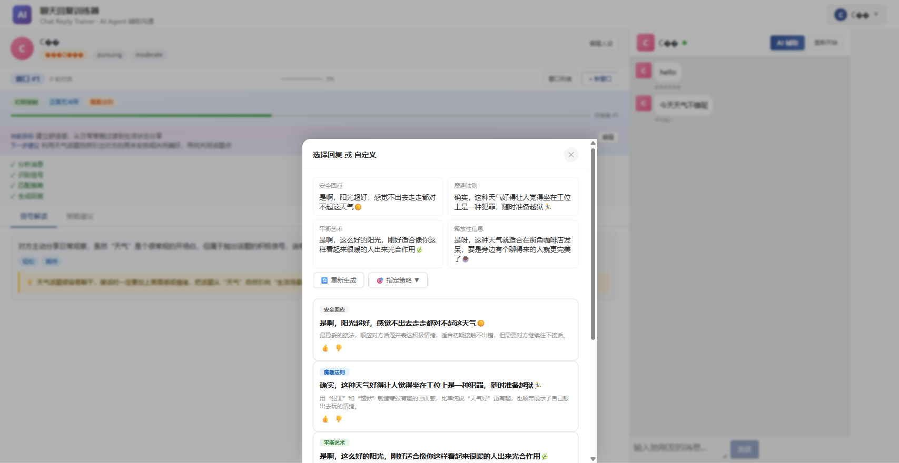
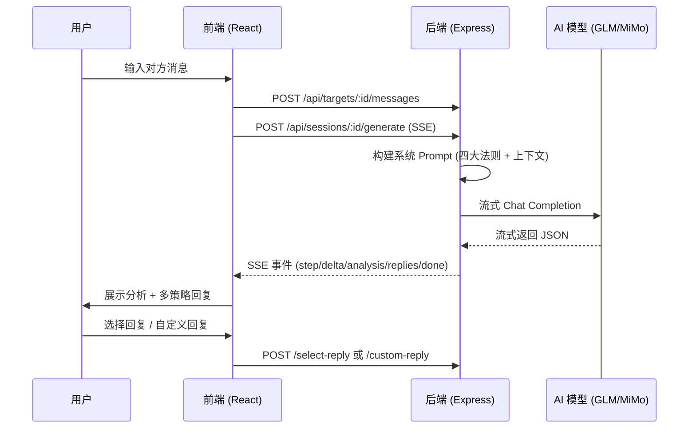
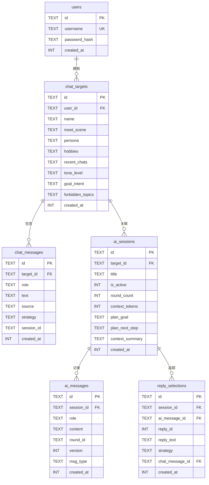

# Chat Reply - AI 聊天回复训练器

> 用 AI 分析对方消息的隐藏信号，生成多策略回复建议，提升你的聊天沟通能力

[](LICENSE)
[]()
[]()
[]()

## 效果展示

<table>
  <tr>
    <td></td>
    <td></td>
  </tr>
  <tr>
    <td align="center">创建聊天对象 & 配置信息</td>
    <td align="center">AI 分析信号 & 多策略回复</td>
  </tr>
</table>

## 功能特性

### 核心功能

- **AI 智能分析**：基于四大沟通法则（扩大冲突、魔趣法则、平衡艺术、释放性信息）实时分析对方消息
- **多策略回复**：每次生成 3-4 条风格各异的回复，标注策略名和推荐理由
- **好感度追踪**：0-100 好感度评分 + 原因分析，历史趋势追踪
- **信号识别**：自动识别正面冲突 / 正面无冲突 / 模糊 / 负面信号

### 双模式生成

- **完整模式**：深度分析（信号、策略、好感度）+ 策略规划 + 多条回复
- **快速模式**：精简 Prompt，快速返回 3 条回复，自动维护对话摘要节省 Token

### 深度分析

- **军师模式**：从态度、情绪、想法三个维度分析对方心理状态，给出下一步方案
- **复盘模式**：总结聊天亮点与踩坑，综合评分（0-100），进阶建议

### 聊天管理

- **多对象管理**：每个聊天对象独立维护配置、消息记录、AI 会话
- **多窗口会话**：同一对象可创建多个 AI 辅导窗口，独立上下文
- **回复版本管理**：重新生成创建新版本，支持版本切换和对比
- **消息编辑 / 删除**：支持编辑和删除已发送的消息
- **聊天记录导入**：支持多种格式（`她：` / `我：`、`【她】` / `【我】`、微信导出）

### 用户体验

- **用户认证**：首次初始化 / 注册 / 登录，JWT 令牌认证
- **新手引导**：注册后自动触发交互式引导教程
- **反馈系统**：对 AI 回复点赞/踩，影响后续策略权重
- **上下文用量追踪**：实时显示 Token 使用百分比
- **移动端适配**：响应式布局，支持手机端使用
- **Demo 模式**：无需登录，共享数据，适合功能展示

## 技术栈

| 层级 | 技术 |
|------|------|
| 前端 | React 19 + TypeScript 6 + Vite 8 + Ant Design 6 + Tailwind CSS v4 |
| 后端 | Express 5 + TypeScript 5 + SQLite (sql.js WASM) |
| AI | 智谱 GLM / 小米 MiMo（OpenAI 兼容 API） |
| 认证 | JWT + bcrypt |

## 架构概览

### 数据流



### Prompt 工程

AI 回复基于四大沟通法则构建系统 Prompt：

| 法则 | 适用场景 | 核心策略 |
|------|---------|---------|
| 扩大冲突 | 收到调侃、质疑、测试 | 反问、夸张、角色扮演升级暧昧 |
| 魔趣法则 | 对方主动分享、积极回应 | 制造有趣的夸张画面，引发好奇 |
| 平衡艺术 | 需要表达好感时 | 先赞美 + 轻松转折化解严肃感 |
| 释放性信息 | 暧昧期推进 | 恰到好处的兴趣表达 |

### 信号识别机制

AI 自动判断对方消息信号类型并匹配对应法则：

- **正面冲突信号** → 扩大冲突（调侃、质疑、废物测试）
- **正面无冲突信号** → 魔趣法则（分享、主动、积极回应）
- **模糊信号** → 安全回应 + 偶尔魔趣（保持舒适感）
- **负面信号** → 安全回应保持距离（冷淡、敷衍、拒绝）

## 快速开始

### 环境要求

- Node.js >= 18
- npm >= 9

### 1. 克隆项目

```bash
git clone https://github.com/Academicrubbish/chat-reply.git
cd chat-reply
```

### 2. 启动后端

```bash
cd chat-reply-server
npm install
cp .env.example .env
# 编辑 .env 填入你的 API Key
npm run dev
```

后端默认运行在 `http://localhost:3001`

### 3. 启动前端

```bash
cd chat-reply-trainer
npm install
npm run dev
```

前端默认运行在 `http://localhost:5173`

### 4. 首次使用

首次启动后访问前端，系统会自动引导你：

1. **初始化账户**：创建管理员用户名和密码
2. **创建聊天对象**：填写对方基本信息和认识场景
3. **新手引导**：系统自动弹出交互式引导教程

> Demo 模式下跳过登录，直接使用。

### 环境变量说明

#### 后端（`chat-reply-server/.env`）

| 变量 | 必填 | 默认值 | 说明 |
|------|------|--------|------|
| `MIMO_API_KEY` | 二选一 | — | 小米 MiMo API 密钥 |
| `MIMO_BASE_URL` | 否 | `https://api.xiaomimimo.com/v1` | MiMo API 地址 |
| `MIMO_MODEL` | 否 | `mimo-v2.5-pro` | MiMo 模型名 |
| `ZHIPU_API_KEY` | 二选一 | — | 智谱 GLM API 密钥 |
| `ZHIPU_BASE_URL` | 否 | `https://open.bigmodel.cn/api/paas/v4/` | GLM API 地址 |
| `ZHIPU_MODEL` | 否 | `glm-5.1` | GLM 模型名 |
| `PORT` | 否 | `3001` | 服务端口 |
| `JWT_SECRET` | 否 | `chat-reply-dev-secret-...` | JWT 签名密钥，**生产环境务必修改** |
| `DEMO_MODE` | 否 | `false` | Demo 展示模式（无需登录，共享数据） |

> 获取小米 MiMo API Key：[platform.xiaomimimo.com](https://platform.xiaomimimo.com)
> 获取智谱 GLM API Key：[open.bigmodel.cn](https://open.bigmodel.cn)

#### 前端（`chat-reply-trainer/.env`）

| 变量 | 必填 | 默认值 | 说明 |
|------|------|--------|------|
| `VITE_DEMO_MODE` | 否 | `false` | 设为 `true` 跳过登录界面 |

## 项目结构

```
chat-reply/
├── chat-reply-server/              # 后端服务
│   ├── src/
│   │   ├── index.ts               # 主入口 + API 路由 (25+ 接口)
│   │   ├── db.ts                  # SQLite 数据库初始化 (6 张表)
│   │   ├── llm.ts                 # AI 模型调用 (流式 + 重试)
│   │   └── prompt.ts              # 提示词工程 (4 种 Prompt 模板)
│   └── .env.example               # 环境变量模板
│
├── chat-reply-trainer/             # 前端应用
│   ├── src/
│   │   ├── App.tsx                # 主应用 (认证流程 + 布局编排)
│   │   ├── types.ts               # TypeScript 类型定义
│   │   ├── hooks/
│   │   │   └── useAppState.tsx    # 全局状态管理 (useReducer + Context)
│   │   ├── services/
│   │   │   └── api.ts             # API 服务层 (REST + SSE 流式)
│   │   ├── components/
│   │   │   ├── SetupPage.tsx      # 首次初始化页
│   │   │   ├── LoginPage.tsx      # 登录页
│   │   │   ├── SignUpPage.tsx     # 注册页
│   │   │   ├── OnboardingPage.tsx # 欢迎引导页
│   │   │   ├── TargetSelector.tsx # 聊天对象选择器
│   │   │   ├── TargetModal.tsx    # 对象创建/编辑弹窗
│   │   │   ├── Toolbar.tsx        # 工具栏 (窗口/模型/分析)
│   │   │   ├── ChatHeader.tsx     # 聊天面板头 (模式切换)
│   │   │   ├── ChatHistory.tsx    # 聊天记录面板
│   │   │   ├── ChatBubble.tsx     # 消息气泡 (含编辑/删除)
│   │   │   ├── MessageInput.tsx   # 消息输入框
│   │   │   ├── RoundTimeline.tsx  # AI 回复时间线 (版本管理)
│   │   │   ├── AnalysisDrawer.tsx # 分析抽屉 (军师/复盘)
│   │   │   └── ...                # 其他组件
│   │   └── utils/
│   │       ├── parseChat.ts       # 聊天记录格式解析
│   │       └── tourGuide.ts       # 新手引导 (driver.js)
│   └── vite.config.ts             # Vite 配置 (API 代理)
│
├── docs/                           # 设计文档
├── ui-initial.png                  # 截图：初始界面
├── ui-ai-reply.png                 # 截图：AI 辅助回复
└── README.md
```

## 数据模型

SQLite 数据库共 6 张表：



## 使用指南

### 基本流程

1. **注册 / 登录**：首次访问创建账户，后续登录使用
2. **创建聊天对象**：点击 "+" 按钮，填写对方信息（姓名、认识场景、性格、兴趣爱好、语气偏好等）
3. **导入聊天记录**（可选）：在对象创建弹窗中粘贴历史聊天记录，支持多种格式
4. **输入对方消息**：在右侧面板输入对方发送的消息
5. **AI 辅助分析**：点击 "AI 辅助" 按钮，获取：
   - 信号分析（对方态度、情绪、好感度）
   - 策略建议（推荐使用的沟通法则）
   - 3-4 条不同风格的回复选项
6. **选择 / 自定义回复**：选择 AI 建议或输入自己的回复
7. **反馈与迭代**：对回复点赞/踩，AI 会学习你的偏好；不满意可重新生成（创建新版本）

### 进阶功能

- **军师分析**：点击工具栏 "军师" 按钮，深度分析对方态度、情绪、想法
- **复盘总结**：点击 "复盘" 按钮，获取聊天表现评分、亮点和踩坑总结
- **多窗口管理**：为同一对象创建多个 AI 辅导窗口，独立管理上下文
- **快速模式**：减少 Token 消耗，快速获取回复建议
- **模型切换**：工具栏下拉切换 MiMo / GLM 模型

## API 文档

共 25 个接口。所有 `/api/*` 路由（除 `/api/auth/*` 和 `/api/health`、`/api/models`）需要 JWT Bearer Token 认证。

### 认证接口

| 方法 | 路径 | 说明 |
|------|------|------|
| GET | `/api/auth/status` | 查询系统是否已初始化 |
| POST | `/api/auth/setup` | 首次初始化（创建管理员） |
| POST | `/api/auth/register` | 注册新用户 |
| POST | `/api/auth/login` | 登录（返回 JWT） |
| POST | `/api/auth/logout` | 登出 |

### 聊天对象

| 方法 | 路径 | 说明 |
|------|------|------|
| GET | `/api/targets` | 获取对象列表 |
| POST | `/api/targets` | 创建对象 |
| GET | `/api/targets/:id` | 获取对象详情 |
| PUT | `/api/targets/:id` | 更新对象信息 |
| DELETE | `/api/targets/:id` | 删除对象（级联删除消息和会话） |

### 消息管理

| 方法 | 路径 | 说明 |
|------|------|------|
| GET | `/api/targets/:id/messages` | 获取消息列表 |
| POST | `/api/targets/:id/messages` | 添加消息（role: her/me/scene） |
| DELETE | `/api/targets/:id/messages` | 清空所有消息 |
| PUT | `/api/messages/:id` | 编辑消息内容 |
| DELETE | `/api/messages/:id` | 删除单条消息 |

### AI 会话

| 方法 | 路径 | 说明 |
|------|------|------|
| GET | `/api/targets/:id/sessions` | 获取会话列表 |
| POST | `/api/targets/:id/sessions` | 创建新窗口 |
| GET | `/api/sessions/:id/messages` | 获取 AI 消息记录 |
| DELETE | `/api/sessions/:id` | 删除窗口 |
| GET | `/api/sessions/:id/selections` | 获取回复选择记录 |

### AI 生成（SSE 流式）

| 方法 | 路径 | 说明 |
|------|------|------|
| POST | `/api/sessions/:id/generate` | AI 生成回复（SSE 流式） |
| POST | `/api/sessions/:id/regenerate` | 重新生成（创建新版本） |

**SSE 事件类型：**

| 事件 | 说明 |
|------|------|
| `step` | 处理步骤（analyze / generating / parsing） |
| `delta` | 流式文本片段 |
| `analysis` | 分析结果（信号、策略、好感度） |
| `plan` | 策略规划 |
| `replies` | 回复选项列表 |
| `reply_ready` | 快速模式：单条回复就绪（渐进展示） |
| `heartbeat` | 心跳（每 2s） |
| `done` | 完成（含 contextUsage） |
| `error` | 错误 |

### 回复操作

| 方法 | 路径 | 说明 |
|------|------|------|
| POST | `/api/sessions/:id/select-reply` | 选择 AI 建议的回复 |
| POST | `/api/sessions/:id/custom-reply` | 提交自定义回复 |

### 深度分析

| 方法 | 路径 | 说明 |
|------|------|------|
| POST | `/api/sessions/:id/analyze` | 军师 / 复盘分析（SSE 流式） |
| GET | `/api/targets/:id/analyses` | 获取分析历史 |
| POST | `/api/sessions/:id/feedback` | 回复反馈（点赞 / 踩） |

### 其他

| 方法 | 路径 | 说明 |
|------|------|------|
| GET | `/api/health` | 健康检查 |
| GET | `/api/models` | 可用模型列表 |

## 许可证

MIT License
