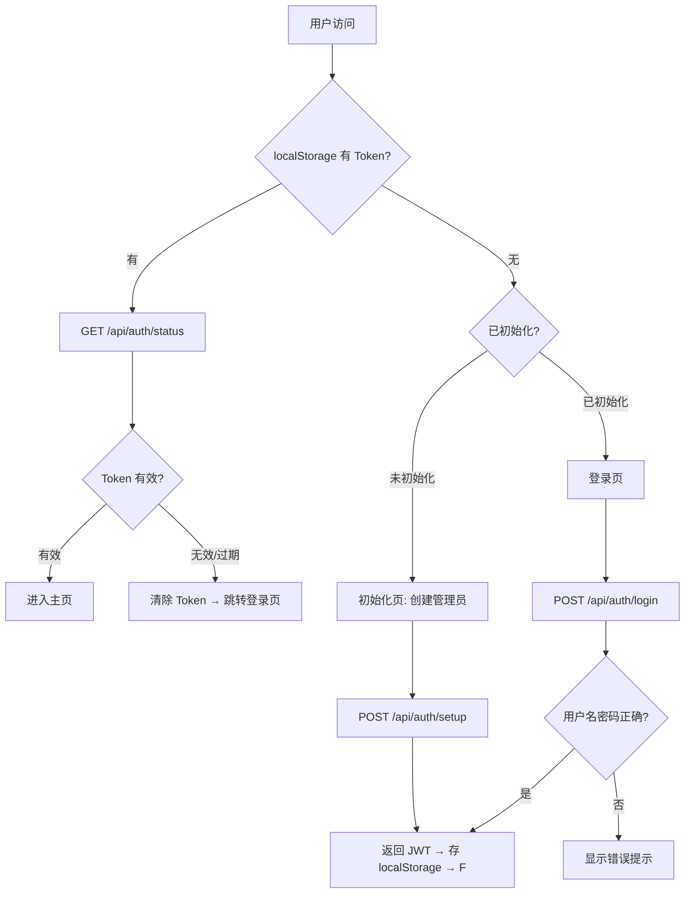
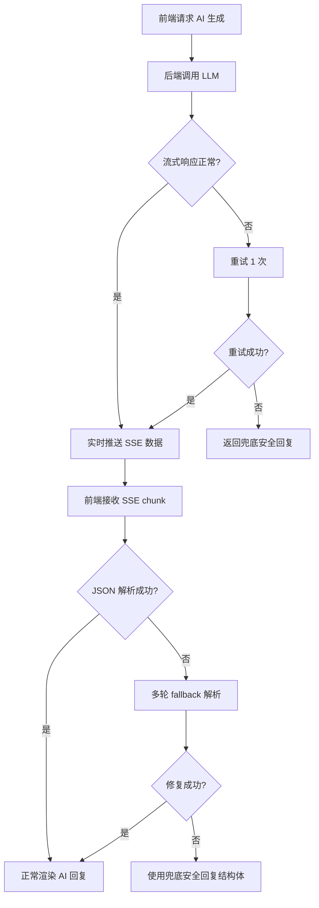
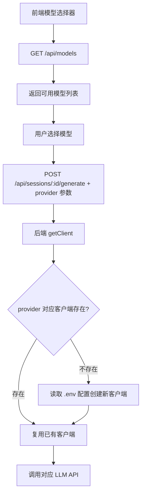
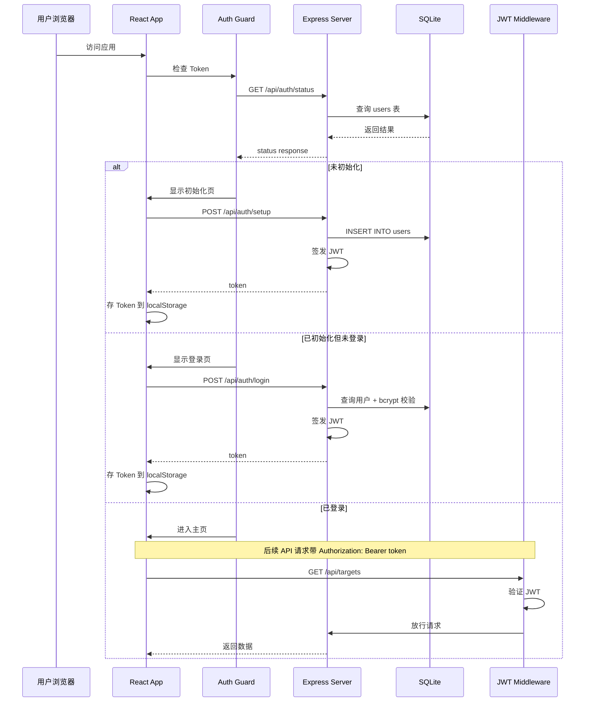
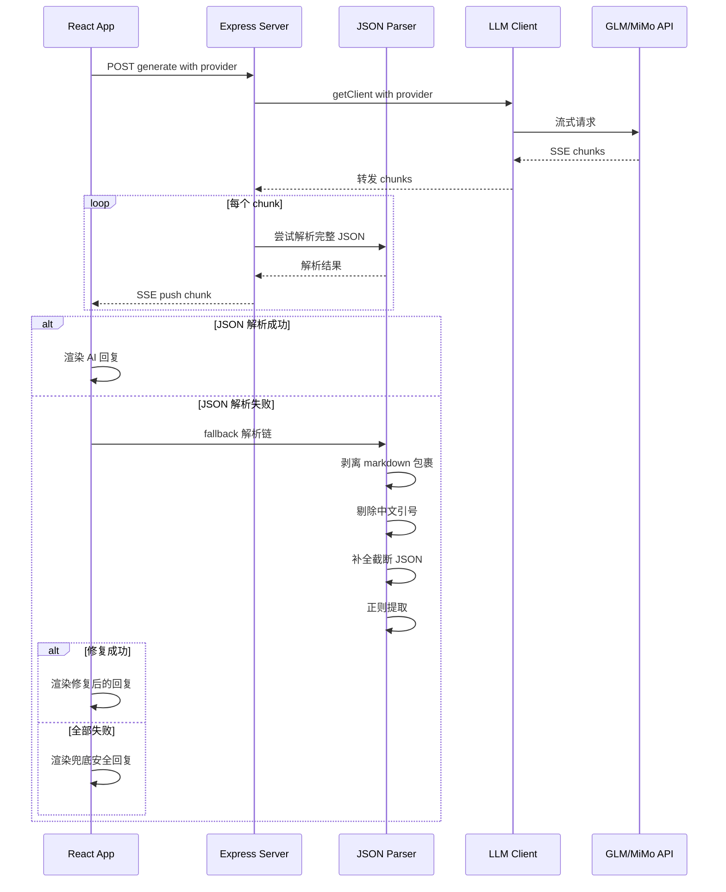

# Chat Reply Trainer V2 Design

## 需求简述

V2 在 V1 核心聊天回复训练功能基础上，增加安全加固（CORS/限流/JSON兜底/Error Boundary）、用户认证（JWT登录）、体验优化（引导页/移动端/删除确认/memoization）和多模型切换（GLM/MiMo）四大方向共 9 个需求。

## 业务逻辑

### 模块划分

| 模块 | 改动类型 | 说明 |
|------|---------|------|
| auth（新增） | 后端 | JWT 认证中间件 + 用户管理路由 |
| security（增强） | 后端 | CORS 限制 + 请求体限制 + 限流 |
| llm（重构） | 后端 | 多模型客户端管理，按 provider 分发 |
| json-parser（增强） | 后端 | 多轮 fallback JSON 解析 + 兜底 |
| login-page（新增） | 前端 | 登录页 + 初始化页 |
| auth-guard（新增） | 前端 | 路由守卫 + Token 管理 |
| error-boundary（新增） | 前端 | 全局 + 局部错误边界 |
| onboarding（新增） | 前端 | 首次使用引导页 |
| mobile-layout（增强） | 前端 | 响应式布局 + Tab 切换 |
| delete-confirm（增强） | 前端 | 删除操作二次确认 |

### 核心流程

#### 认证流程



#### AI 生成增强流程



#### 多模型切换流程



## 时序图

### 登录认证时序



### AI 生成增强时序



## 数据结构

### 新增 users 表

```sql
CREATE TABLE users (
  id TEXT PRIMARY KEY,
  username TEXT NOT NULL UNIQUE,
  password_hash TEXT NOT NULL,   -- bcrypt 哈希，约 60 字符
  created_at INTEGER NOT NULL    -- Unix timestamp
);
```

### JWT Token Payload

```typescript
interface JWTPayload {
  userId: string;      // users.id
  username: string;    // users.username
  iat: number;         // 签发时间
  exp: number;         // 过期时间（24h）
}
```

### 前端 Auth State

```typescript
interface AuthState {
  token: string | null;          // localStorage 存储
  isInitialized: boolean | null; // 系统是否已初始化
  isLoading: boolean;            // 登录/初始化请求中
  error: string | null;          // 错误信息
}
```

### 多模型配置

```typescript
interface ModelConfig {
  provider: string;     // "zhipu" | "mimo"
  label: string;        // 显示名称
  apiKeyEnv: string;    // 环境变量名
  baseUrlEnv: string;   // 环境变量名
  modelEnv: string;     // 环境变量名
}
```

### JSON 兜底回复结构

```typescript
const SAFE_FALLBACK = {
  analysis: {
    stage: "分析中", signal: "模糊", strategy: "安全回复",
    signalText: "AI 返回格式异常，已降级处理", emotions: [],
    tip: "建议重新生成", favorability: 50
  },
  plan: { goal: "维持当前关系", nextStep: "继续对话" },
  replies: [
    { id: 1, strategy: "安全回复", text: "嗯嗯，确实", reason: "降级兜底回复" }
  ]
};
```

## 边界情况

| 场景 | 处理方式 |
|------|---------|
| setup 接口被重复调用 | 查询 users 表是否为空，非空返回 403 |
| JWT 过期 | 前端捕获 401 响应，清除 Token，跳转登录页 |
| JWT 被篡改 | 中间件验证签名，无效返回 401 |
| AI 返回完全无法解析的内容 | 经多轮 fallback 后返回 SAFE_FALLBACK 结构 |
| AI 流式响应中断 | 重试 1 次，仍失败返回兜底回复 |
| 请求体超过 100KB | express.json limit 中间件直接返回 413 |
| 外部域名请求 | CORS 拒绝非白名单 origin |
| 限流触发 | express-rate-limit 返回 429 |
| 未配置某模型的 .env | /api/models 不返回该模型，前端不展示 |
| 移动端 Tab 切换状态丢失 | 用 useState 保留当前 Tab，不依赖 URL |
| ErrorBoundary 捕获异步错误 | 需在事件处理器中 try-catch，ErrorBoundary 仅捕获渲染阶段错误 |
| 刷新页面时 Token 仍有效 | Token 存 localStorage，页面加载时读取并验证 |

## 错误处理

### 后端错误码规范

| HTTP 状态码 | 场景 | 响应体 |
|-------------|------|--------|
| 401 | 未提供 Token / Token 无效 / Token 过期 | `{ error: "认证失败，请重新登录" }` |
| 403 | 已初始化时调用 setup | `{ error: "系统已初始化" }` |
| 413 | 请求体超限 | `{ error: "请求体过大" }` |
| 429 | 限流触发 | `{ error: "请求过于频繁，请稍后重试" }` |
| 500 | LLM 调用失败（重试后仍失败） | 返回 SAFE_FALLBACK，不抛 500 |

### 前端错误处理层级

```
Level 1: API 层 — api.ts 中统一处理 HTTP 错误码
  ├── 401 → 清除 Token，跳转登录页
  ├── 429 → 提示"请求过于频繁"
  └── 其他 → 抛出错误给上层

Level 2: 组件层 — try-catch 包裹事件处理和异步操作
  ├── LLM 生成失败 → 显示错误提示 + 重试按钮
  └── 网络异常 → 显示"网络错误"提示

Level 3: ErrorBoundary — 捕获渲染阶段未处理的异常
  ├── 全局 ErrorBoundary → 显示"页面出了点问题" + 重试按钮
  └── 局部 ErrorBoundary → 显示"该区域加载失败" + 重试按钮
```

### JSON 解析 Fallback 链

```
尝试 1: JSON.parse(原始文本)
  ↓ 失败
尝试 2: JSON.parse(剥离 markdown 代码块包装)
  ↓ 失败
尝试 3: JSON.parse(替换中文引号)
  ↓ 失败
尝试 4: JSON.parse(补全截断括号和引号)
  ↓ 失败
尝试 5: 正则提取 { ... } 最大匹配块
  ↓ 失败
兜底: 返回 SAFE_FALLBACK 固定结构
```

## 扩展性设计

### 多模型客户端池

采用懒初始化 + 缓存模式，新增模型只需在 `.env` 添加配置 + 在 `MODEL_REGISTRY` 注册：

```typescript
const MODEL_REGISTRY: ModelConfig[] = [
  { provider: "zhipu", label: "智谱 GLM", apiKeyEnv: "ZHIPU_API_KEY", ... },
  { provider: "mimo", label: "小米 MiMo", apiKeyEnv: "MIMO_API_KEY", ... },
  // 未来扩展：只需在此添加新行
];

const clients: Record<string, OpenAI> = {};

function getClient(provider: string): OpenAI {
  if (!clients[provider]) {
    const config = MODEL_REGISTRY.find(m => m.provider === provider);
    clients[provider] = new OpenAI({
      apiKey: process.env[config.apiKeyEnv],
      baseURL: process.env[config.baseUrlEnv],
    });
  }
  return clients[provider];
}
```

新增模型只需 3 步：1) `.env` 添加配置 2) `MODEL_REGISTRY` 添加一行 3) 无需改前端代码

### 认证扩展预留

当前 JWT 为单用户简化版。如需多用户，扩展点：
- `users` 表已预留 id 字段，可添加 role 字段支持角色权限
- JWT middleware 已做中间件抽取，可替换为 session 方案

## 性能设计

### RoundTimeline Memoization

```typescript
// 1. useMemo 缓存解析结果
const rounds = useMemo(
  () => parseAiMessages(aiMessages),
  [aiMessages]  // 仅在 aiMessages 引用变化时重算
);

// 2. React.memo 包裹组件
const RoundTimeline = React.memo(function RoundTimeline({ rounds, ... }) {
  // ...
}, (prev, next) => {
  return prev.rounds === next.rounds;  // 引用比较，useMemo 保证稳定
});
```

### 移动端性能

- Tab 切换使用 `display: none/block` 而非卸载/挂载，保留 DOM 状态
- 避免在 < 768px 下加载桌面端特有的布局计算逻辑

### SSE 流式处理

- 保持现有 EventSource/SSE 流式架构，前端逐 chunk 拼接
- JSON 解析仅在流结束时执行（已收集完整响应后），不在中间 chunk 解析

## 变更记录

| 日期 | 作者 | 变更内容 |
|------|------|---------|
| 2026-05-29 | yuanchuang | 初始版本 |
