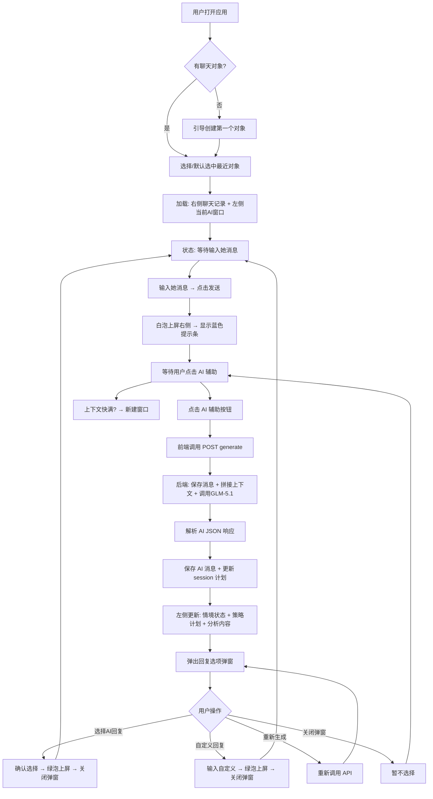
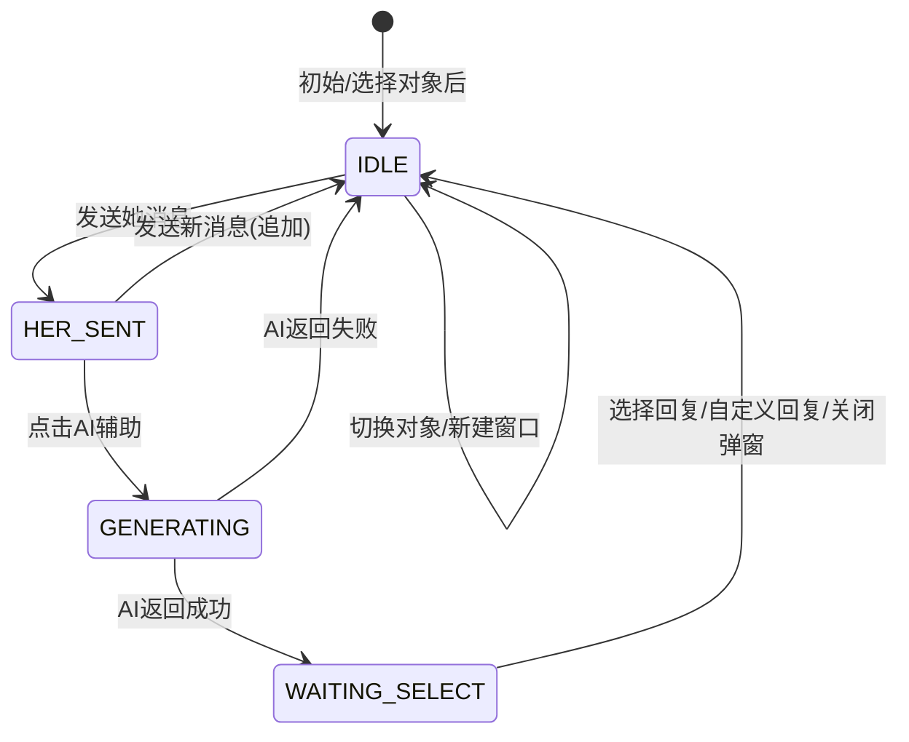
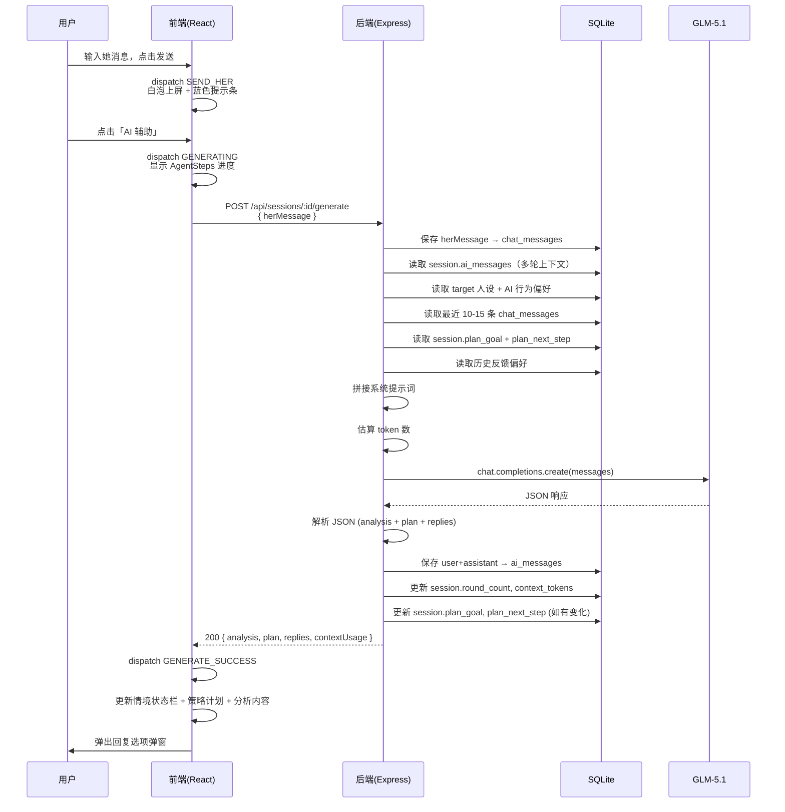
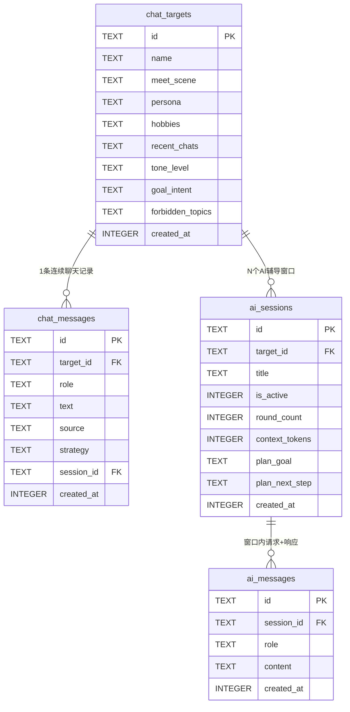
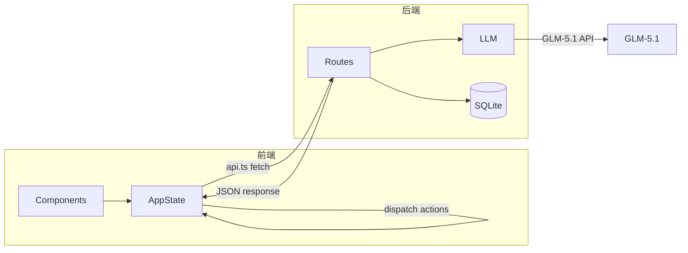

# 聊天回复训练器（Chat Reply Trainer）一期 Design

## 需求简述

构建左右分栏本地 Web 应用（左 70% AI Agent 控制台 + 右 30% 微信聊天模拟器），支持多聊天对象管理、AI 辅导窗口上下文隔离、对话策略动态规划。用户输入对方消息 → 后端调用 GLM-5.1 API 分析信号并生成回复选项 → 用户点选/自定义回复上屏，闭环训练。数据通过 SQLite 持久化，前后端分离部署。

技术栈：React 18 + TypeScript + Vite（前端）、Express + better-sqlite3（后端）、OpenAI SDK 兼容方式调用智谱 GLM-5.1（AI）。

## 业务逻辑

### 模块划分

按前后端分层，共 4 个模块：

| 模块 | 目录 | 职责 | 关联功能 |
|------|------|------|---------|
| 前端视图层 | `chat-reply-trainer/src/components/` | 16 个 UI 组件：人设卡片、聊天模拟器、回复弹窗、分析面板等 | F1-F9 |
| 前端状态层 | `chat-reply-trainer/src/hooks/` + `src/services/` | 全局状态管理（useReducer + Context）、API 调用封装 | F1-F8 |
| 后端 API 层 | `chat-reply-server/src/routes/` | Express 路由：聊天对象 CRUD、消息管理、AI 窗口管理、核心 generate 接口 | F1-F6, F10-F11 |
| 后端 AI 层 | `chat-reply-server/src/llm.ts` + `src/prompt.ts` | GLM-5.1 调用、系统提示词拼接、JSON 解析 | F4, F6 |

### 目录结构

```
reply/
├── chat-reply-trainer/              # 前端
│   ├── src/
│   │   ├── components/
│   │   │   ├── TargetSelector.tsx    # 聊天对象选择器
│   │   │   ├── TargetModal.tsx       # 新建/编辑对象弹窗
│   │   │   ├── PersonCard.tsx        # 人设卡片
│   │   │   ├── SessionBar.tsx        # 辅导窗口管理条
│   │   │   ├── PlanCard.tsx          # 对话策略计划卡片
│   │   │   ├── ContextBar.tsx        # 情境状态栏
│   │   │   ├── AnalysisTabs.tsx      # 信号分析/策略建议 Tab
│   │   │   ├── AgentSteps.tsx        # AI 工作步骤进度
│   │   │   ├── ReplyGrid.tsx         # 回复选项 2x2 四宫格
│   │   │   ├── ReplyCard.tsx         # 单张回复卡片（含👍/👎）
│   │   │   ├── CustomReply.tsx       # 自定义回复输入
│   │   │   ├── ChatHeader.tsx        # 右侧聊天 Header
│   │   │   ├── ChatHistory.tsx       # 消息流列表
│   │   │   ├── ChatBubble.tsx        # 单条聊天气泡
│   │   │   └── MessageInput.tsx      # 右侧消息输入框
│   │   ├── hooks/
│   │   │   └── useAppState.ts        # 全局状态 hook
│   │   ├── services/
│   │   │   └── api.ts                # API 调用封装
│   │   ├── types.ts                  # TypeScript 类型定义
│   │   ├── App.tsx                   # 主布局组件
│   │   ├── App.css                   # 全局样式
│   │   └── main.tsx                  # 入口
│   ├── vite.config.ts
│   ├── package.json
│   └── index.html
│
├── chat-reply-server/               # 后端
│   ├── src/
│   │   ├── index.ts                  # Express 应用入口
│   │   ├── db.ts                     # SQLite 数据库初始化
│   │   ├── llm.ts                    # GLM-5.1 API 调用封装
│   │   ├── prompt.ts                 # 系统提示词构建
│   │   └── routes/
│   │       ├── targets.ts            # 聊天对象 CRUD
│   │       ├── messages.ts           # 聊天消息 API
│   │       └── sessions.ts           # AI 辅导窗口 + generate + 回复操作
│   ├── package.json
│   ├── tsconfig.json
│   └── .env                          # ZHIPU_API_KEY 等
│
└── docs/                             # 文档
```

### 核心流程



### 状态机设计

应用使用有限状态机管理主流程，共 5 个状态：



| 状态 | 含义 | UI 表现 |
|------|------|---------|
| `IDLE` | 等待输入她消息 | 右侧输入框可用，左侧显示上次分析结果或等待态 |
| `HER_SENT` | 已发送她消息，等待点击AI辅助 | 右侧显示蓝色提示条「点击AI辅助」 |
| `GENERATING` | AI 分析中 | 左侧显示 AgentSteps 进度，右侧 AI 辅助按钮 loading |
| `WAITING_SELECT` | 弹出回复选项弹窗 | 弹窗显示四宫格 + 自定义回复区 |

## 时序图

### 核心流程：AI 辅助生成回复



### 回复选择流程

```mermaid
sequenceDiagram
    participant U as 用户
    participant FE as 前端
    participant BE as 后端
    participant DB as SQLite

    alt 选择 AI 回复
        U->>FE: 点击回复卡片 → 确认
        FE->>BE: POST /api/sessions/:id/select-reply<br/>{ replyId }
        BE->>BE: 找到对应 reply
        BE->>DB: 存入 chat_messages (role:'me', source:'AI建议', strategy)
        BE-->>FE: 200 { success }
        FE->>FE: 绿泡上屏 + 关闭弹窗
    else 自定义回复
        U->>FE: 输入自定义文本 → 发送
        FE->>BE: POST /api/sessions/:id/custom-reply<br/>{ text }
        BE->>DB: 存入 chat_messages (role:'me', source:'自定义回复')
        BE-->>FE: 200 { success }
        FE->>FE: 绿泡上屏 + 关闭弹窗
    else 反馈
        U->>FE: 点击 👍/👎
        FE->>BE: POST /api/sessions/:id/feedback<br/>{ replyId, rating }
        BE->>DB: 记录反馈
        BE-->>FE: 200 { success }
    end
end
```

## 数据结构

### SQLite 表设计



### TypeScript 类型定义

```typescript
// ===== 聊天对象 =====
interface ChatTarget {
  id: string;
  name: string;
  meetScene: string;
  persona: string;
  hobbies: string;
  recentChats: string;
  toneLevel: 'aggressive' | 'moderate' | 'conservative';
  goalIntent: 'practice' | 'pursuing' | 'friendship';
  forbiddenTopics: string;
  createdAt: number;
}

// ===== 聊天消息 =====
interface ChatMessage {
  id: string;
  targetId: string;
  role: 'her' | 'me';
  text: string;
  source: '手动输入' | 'AI建议' | '自定义回复';
  strategy?: string;
  sessionId?: string;
  createdAt: number;
}

// ===== AI 辅导窗口 =====
interface AISession {
  id: string;
  targetId: string;
  title: string;
  isActive: boolean;
  roundCount: number;
  contextTokens: number;
  planGoal: string;
  planNextStep: string;
  createdAt: number;
}

// ===== AI 辅导消息 =====
interface AIMessage {
  id: string;
  sessionId: string;
  role: 'user' | 'assistant';
  content: string;
  createdAt: number;
}

// ===== AI 生成响应 =====
interface GenerateResponse {
  analysis: {
    stage: string;
    signal: string;
    strategy: string;
    signalText: string;
    emotions: string[];
    tip: string;
    favorability: number;
  };
  plan: {
    goal: string;
    nextStep: string;
  };
  contextUsage: {
    estimatedTokens: number;
    maxTokens: number;
    percentage: number;
  };
  replies: Array<{
    id: number;
    strategy: string;
    text: string;
    reason: string;
  }>;
}

// ===== 前端应用状态 =====
type AppPhase = 'idle' | 'her_sent' | 'generating' | 'waiting_select';

interface AppState {
  phase: AppPhase;
  targets: ChatTarget[];
  currentTargetId: string | null;
  messages: ChatMessage[];
  sessions: AISession[];
  currentSessionId: string | null;
  aiMessages: AIMessage[];
  currentAnalysis: GenerateResponse['analysis'] | null;
  currentReplies: GenerateResponse['replies'] | null;
  currentPlan: { goal: string; nextStep: string } | null;
  contextUsage: { estimatedTokens: number; maxTokens: number; percentage: number } | null;
  error: string | null;
}
```

### 数据流向



## 边界情况

| 场景 | 处理策略 | 说明 |
|------|---------|------|
| 无聊天对象时打开应用 | 显示空状态引导，提示创建第一个对象 | 左右面板均显示引导内容 |
| 单个对象的聊天记录为空 | 右侧显示系统消息「—— 开始新对话 ——」 | 正常状态 |
| 切换聊天对象 | 加载新对象的聊天记录 + 最近活跃的 AI 窗口 | 旧对象状态保留在内存 |
| 新建 AI 辅导窗口 | 只带人设 + 最近 10-15 条聊天消息，上下文完全重置 | 旧窗口标记为非活跃 |
| AI 上下文用量 >80% | 进度条变橙色 + 显示「建议新建窗口」提示 | 不强制，仅建议 |
| 同时输入多条她消息 | 支持连续发送，以最后一条触发 AI 分析 | HER_SENT 状态可继续发送 |
| 对话策略计划更新 | AI 每次分析后可返回新的 plan_goal/plan_next_step，更新 session | 用户也可手动编辑 |
| 删除聊天对象 | 级联删除 chat_messages + ai_sessions + ai_messages | 需确认弹窗 |
| 反馈影响后续生成 | 后端读取历史反馈偏好拼入提示词：「用户对平衡艺术反馈👍，对安全回复反馈👎」 | 渐进优化 |

## 错误处理

### 错误场景及策略

| 场景 | 触发条件 | 处理方式 | UI 表现 |
|------|---------|---------|---------|
| API Key 未配置 | .env 无 ZHIPU_API_KEY | 后端返回 500 `{ error }` | 左侧面板显示红色错误卡片 + 配置提示 |
| GLM-5.1 调用失败 | 网络超时 / API 限流 / 服务异常 | 后端 catch 返回 500 | 左侧面板显示错误提示 + 「重试」按钮 |
| 响应 JSON 解析失败 | AI 返回非 JSON | 后端 try-catch，返回 `{ error }` | 同上 |
| 空消息发送 | 输入框为空 | 前端拦截 | 发送按钮 disabled |
| 重复 AI 请求 | phase=generating 时点击 AI 辅助 | 前端状态判断，忽略 | AI 辅助按钮 loading 状态 |
| SQLite 操作失败 | 数据库锁定 / 磁盘满 | 后端 catch 返回 500 | 错误提示 |
| Session 不存在 | sessionId 无效或已删除 | 后端返回 404 | 错误提示 + 引导新建窗口 |
| Target 不存在 | targetId 无效 | 后端返回 404 | 错误提示 + 引导选择对象 |

### 后端错误处理模式

```typescript
// 统一错误处理中间件
app.use((err: Error, req: Request, res: Response, next: NextFunction) => {
  console.error(err.stack);
  res.status(500).json({ error: '服务异常，请稍后重试' });
});

// 路由内 try-catch
router.post('/sessions/:sessionId/generate', async (req, res) => {
  try {
    // ... 业务逻辑
  } catch (err) {
    res.status(500).json({ error: err.message || 'AI 服务异常' });
  }
});
```

## 扩展性设计

### 二期预留：AI 自动完善用户画像

当前设计已为二期需求（AI 自动从聊天中提取关键信息写入结构化画像）预留接口：

- `chat_targets` 表的 `recent_chats` 字段可扩展为 JSON 结构化画像
- AI 提示词中「对方人设」部分可从纯文本替换为结构化 JSON
- 可新增 `target_profile` 表存储提取的结构化信息（饮食过敏、作息、工作、兴趣等）
- `ai_sessions` 的上下文管理机制可直接复用（滑动窗口 + 新窗口重置）

### 策略扩展

四大法则当前硬编码在 `prompt.ts` 中。未来可扩展为：
- 策略存储在数据库或配置文件中，支持动态添加
- 用户可自定义策略名和描述

## 性能设计

### 前端性能

| 关注点 | 方案 |
|--------|------|
| 聊天消息列表 | `useRef` + `scrollTop` 自动滚动，100 条内无需虚拟滚动 |
| 回复弹窗动画 | CSS `transform` + `transition`（GPU 加速），避免 JS 动画 |
| 组件渲染优化 | `React.memo` 包裹 `ChatBubble`、`ReplyCard` 等高频组件 |
| CSS 性能 | 纯 CSS，无运行时 CSS-in-JS 开销；动画使用 `transform` + `opacity` |

### 后端性能

| 关注点 | 方案 |
|--------|------|
| SQLite 连接 | better-sqlite3 同步 API，单连接复用，无需连接池 |
| 滑动窗口查询 | `idx_messages_target(target_id, created_at)` 索引支持最近 N 条高效查询 |
| AI 请求耗时 | 目标 < 5s；后端不设超时（GLM-5.1 自身有超时机制）；前端显示步骤进度缓解等待感 |
| 提示词 token 控制 | 系统提示词约 1500 token + 最近 10-15 条聊天约 500 token + AI 多轮历史约 2000 token，总计约 4000 token |
| API 代理 | Vite proxy `/api` → `localhost:3001`，避免跨域开销 |

### 并发策略

- 前端状态机保证同一时刻只有 1 个 AI 请求
- 后端无并发控制需求（本地单用户应用）
- better-sqlite3 WAL 模式支持读写并发

## 变更记录
| 日期 | 作者 | 变更内容 |
|------|------|---------|
| 2026-05-28 | yuanchuang | 初始版本（完整一期设计，含多对象、SQLite、GLM-5.1、辅导窗口、反馈机制） |
